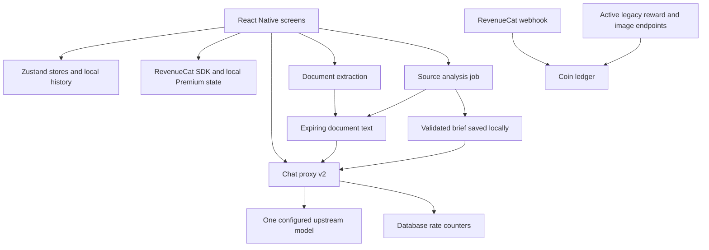

**Cloud AI product and engineering audit**

Prepared 3 October 2026 for the product owner. Repository: `C:\nova`, base commit `caea860`, including the working tree. Connected backend: Supabase project `NovaAi`. This is an engineering and product assessment, not a certification or a claim that every device, provider, and failure mode has been tested.

**Verdict: substantial, intermediate engineering with some strong components, but not yet a consistently mature production system.** The product has useful capabilities and real implementation depth. The document workspace shows particularly good defensive engineering. However, backend access controls, monetary operations, deployment reproducibility, streaming, and persistence have confirmed weaknesses. I would prioritize those before increasing acquisition spend or adding more AI features. An incremental hardening program is appropriate; a complete rewrite is not justified by the evidence.

The main problem is inconsistent guarantees across features. The newer workspace has ownership capabilities, validated results, and recovery logic. Older endpoints trust device identifiers supplied by callers, expose unearned credits, and remain active after their UI has been disabled. The app and backend also disagree about what a model selection means.

Only read operations were performed against production. No real credits were granted, no paid inference was triggered, and no database policies, secrets, deployments, or customer records were changed. Local synthetic probes were created in the ignored `tmp/app-audit-2026-10-03` directory. Existing application edits were left intact. More UI files changed externally during this audit; UI findings are a snapshot, not an assertion about a frozen release.

The scope included app startup and navigation, chat orchestration, model selection, assistants, streaming, document and video workflows, subscriptions, rewards and image endpoints, local persistence, privacy boundaries, deployed functions, database grants/policies/routines/indexes, cleanup jobs, aggregate logs, tests, and dependency advisories. I inspected deployment metadata for 15 active functions and downloaded source for 12, including the main production flows and older endpoints. Three canary functions were inventoried but their complete source was not separately audited.

I did not run a fresh Android release on a physical device, buy or restore a real subscription, benchmark answer quality against real customer tasks, load-test production, inspect customer document contents, verify Play Console signing arrangements, or inspect provider-account retention overrides. Those remain necessary release checks.

The current product connects as follows:

| Area | What is implemented | Assessment |
| --- | --- | --- |
| Chat | Streaming, history, regeneration, context trimming, image inputs, optional web search | Useful core; confirmed stream and save defects need correction |
| Model selection | Ten displayed chat models/providers, Premium restrictions in the client | Deployed router collapses selections to one model; product contract needs correction |
| Assistants | Persona prompts, suggestions, shared chat experience | Convenient templates; not distinct task engines or autonomous agents |
| Documents | PDF/DOCX/TXT/CSV extraction, multiple documents, structured brief, evidence quotes, follow-up chat | Strongest foundation; no OCR and limited structural/page provenance |
| Video | YouTube/upload/transcript workflows, audiovisual analysis, recoverable jobs, follow-up context | Meaningful functionality; follow-up uses the saved analysis, not a fresh examination of the original video |
| Premium | RevenueCat offerings, purchase/restore flows, cache/readiness handling, deferred user actions | Client integration has care; backend does not enforce the same entitlement rules |
| Image Studio and rewards | Considerable implementation exists; current app feature flags disable both | Backend attack and cost surface remains active |
| Persistence | Local chat records/index, saved briefs, pending jobs, Keychain identities | No account-based cloud continuity; chat writes have concurrency defects |
| Operations | Supabase logs, some budgets, hourly expiry jobs, tests and canary work | Missing a reproducible deployment baseline, useful app telemetry, and comprehensive release gates |

Evidence for feature state: [feature flags](C:/nova/src/constants/featureFlags.js), [workspace integration](C:/nova/src/lib/workspaceChat.js), [assistant presets](C:/nova/src/data/presets.js), and [subscription integration](C:/nova/src/context/SubscriptionContext.js). File links identify local Windows files.

The following findings are ordered by remediation priority. P0 means an immediately actionable production exposure; P1 means a significant issue to resolve before growth; P2 means a durability or quality improvement. Source-confirmed paths were not exploited against production.

1. **P0 — Credit grants can be requested without earning or purchasing them.**

   Deployed `rc-webhook` v28 has JWT verification disabled, which can be appropriate for a webhook with its own authentication. However, its `grant_reviewer_coins` branch executes before webhook-secret validation. That branch grants 1,000 credits to a caller-supplied device ID without a reviewer allowlist or authenticated identity. Its per-device duplicate check does not establish reviewer authorization.

   Independently, deployed `dynamic-processor` v18 grants enabled catalog rewards using caller-supplied device and job IDs. It checks duplicate jobs but does not verify earned points or debit `coin_cost`. New job IDs represent new grants. Current catalog configuration has enabled credit rewards. These endpoints feed the ledger used by the still-active image function. Hiding rewards in the app does not close these server paths.

   Fix: require an authenticated principal, enforce reward eligibility and point consumption in an atomic server operation, and make reviewer access a server-managed, expiring grant. Disable unused grant paths after checking older supported clients. Validate denied anonymous grants and repeated/concurrent redemptions in a staging environment.

   Evidence: [deployed reviewer dispatch](C:/nova/tmp/app-audit-2026-10-03/deployed/rc-webhook/index.ts:426), [reviewer grant](C:/nova/tmp/app-audit-2026-10-03/deployed/rc-webhook/index.ts:126), [reward inputs](C:/nova/tmp/app-audit-2026-10-03/deployed/dynamic-processor/index.ts:108), [reward insertion](C:/nova/tmp/app-audit-2026-10-03/deployed/dynamic-processor/index.ts:233).

2. **P0 — Public database access undermines the coin system.**

   Live `rewards_catalog` has RLS disabled and grants `INSERT`, `UPDATE`, and `DELETE` to both `anon` and `authenticated`. This permits callers using the public app key to alter reward configuration. The `coins_balance` view is owned by `postgres`, lacks `security_invoker=true`, and is selectable by `anon`. Its definition exposes device IDs and their balances without an ownership filter. A read-only transaction under the anonymous role could count **1,395 visible balance rows**. No identifiers or balances were exported for this check.

   This matters beyond information disclosure: deployed `images-runware` accepts the device ID from the request as the debit identity. The view exposes identifiers used by that weak authorization scheme. The source therefore supports a risk of spending another device's credits; no such request was made.

   Fix: revoke unnecessary grants, define intentional catalog read policies, replace the public balance view with an ownership-enforcing access path, and bind every debit to a verified principal. Do not blindly enable RLS without defining intended client access. RLS must be paired with appropriate grants; a view can bypass the underlying table's policies. [Supabase RLS documentation](https://supabase.com/docs/guides/database/postgres/row-level-security). Advisor remediation references: [public-table RLS](https://supabase.com/docs/guides/database/database-linter?lint=0013_rls_disabled_in_public) and [definer views](https://supabase.com/docs/guides/database/database-linter?lint=0010_security_definer_view).

3. **P1 — The Android upload key and literal signing passwords are tracked.**

   Git tracks `android/app/aily-upload-key.jks`. It also tracks nonempty literal `MYAPP_UPLOAD_STORE_PASSWORD` and `MYAPP_UPLOAD_KEY_PASSWORD` values in `android/gradle.properties`. No password values are reproduced here. The release build references this signing configuration. The debug keystore is not the concern.

   Fix: establish who could access the repository and its history, replace the exposed upload credential through the applicable Play signing process, then move signing material to a managed secret store and remove it from tracked files/history as appropriate. Simply deleting the current file does not invalidate copies. Whether this is only an upload key or also the distribution signing key needs confirmation in Play Console; I did not assume the larger impact.

   Evidence: [signing properties](C:/nova/android/gradle.properties:46), [Android build configuration](C:/nova/android/app/build.gradle).

4. **P1 — Premium and identity are not consistently enforced by the server.**

   The client gates paid models, assistants, document uploads, workspace analyses, and web search. The reviewed production chat/document/source-analysis handlers do not verify a paid entitlement. They receive the public anonymous JWT and caller-selected identifiers; knowing the app key is not proof of a particular user or subscription. The source workspace's separate Keychain capability is a useful job-access control, but it does not prove a paid plan. Document ownership uses a raw-device hash, a different trust model.

   Fix: introduce one authenticated principal and a shared server authorization layer. A low-friction guest account can later link to an email or platform account. Link RevenueCat ownership to that identity and enforce capability/usage policies before paid work. Preserve existing purchases and device data through an explicit migration. Treat device identifiers as metadata, not authorization secrets. Validate free, paid, expired, refunded, restored, and cross-user cases.

   Evidence: [client request headers](C:/nova/src/api/streamChat.js:24), [Premium rules](C:/nova/src/config/premium.js), [production chat handler](C:/nova/tmp/app-audit-2026-10-03/deployed/chat-proxy-v2/index.ts:960), [source access checks](C:/nova/supabase/functions/source-analyze/index.ts:233), [document access](C:/nova/supabase/functions/document-process/index.ts:76).

5. **P1 — The model picker does not represent the model being used.**

   UI configuration advertises OpenAI, Anthropic, Google, xAI, and DeepSeek choices. Both repository and deployed v2 routing replace the requested model with `gpt-6-luna` in normal mode; emergency mode routes all choices to the configured GLM model. The rollout test explicitly expects the common upstream mapping. This is deliberate behavior, not a speculative provider outage.

   Premium model choices therefore do not currently buy access to the named upstream models. Client fallback also normally changes only the displayed model ID, then reaches the same provider/model again. That does not provide independent provider resilience.

   Fix: either deliver the selected model and expose actual fallback provenance, or sell honestly named task modes such as Fast and Detailed with transparent routing. Return requested model, actual model, provider, and fallback reason in the response contract. Measure quality/cost by actual route. Do not infer provider availability from model labels.

   Evidence: [displayed models](C:/nova/src/config/models.js:35), [upstream override](C:/nova/supabase/functions/chat-proxy-v2/index.ts:709), [rollout expectations](C:/nova/__tests__/chatProxyV2Rollout.test.js:25), [fallback policy](C:/nova/src/api/streamChat.js:135).

6. **P1 — Production cannot be reliably reproduced from this checkout.**

   Deployed `chat-proxy-v2` v14 contains roughly 248 more lines than the repository entrypoint, including persistent rate limits, request bounds, and global budgets. Those protections are missing from the local entrypoint. The deployed image entrypoint also differs. Source for `rc-webhook`, `dynamic-processor`, `smart-api`, `object-removal`, `upscale-function`, and legacy `chat-proxy` is absent from the normal local functions tree. Two local migrations do not recreate all seven public tables; live migration history contains only one recorded migration, with a different timestamp from the corresponding local file.

   Fix: recover the exact deployed source and schema into version control, reconcile migration history deliberately, and prove a clean staging environment can be created from the repo. Require CI tests and a reviewed, identifiable deployment artifact. Add an inventory of active endpoints and retire unused ones. Do not redeploy the stale local chat entrypoint as part of routine cleanup.

   Evidence: [repository handler](C:/nova/supabase/functions/chat-proxy-v2/index.ts:733), [deployed abuse protection](C:/nova/tmp/app-audit-2026-10-03/deployed/chat-proxy-v2/index.ts:12), [local function configuration](C:/nova/supabase/config.toml), production source snapshots in `tmp/app-audit-2026-10-03/deployed`.

7. **P1 — Stream completion can duplicate events and conceal incomplete answers.**

   `SSEClient._onProgress` re-appends the entire accumulated response when final flush receives no new bytes. A synthetic progress event followed by final flush emitted `Hello` twice and two completion events. The application has a completion guard, but tokens are still forwarded after completion, so that guard does not fix the transport contract.

   Separately, the provider emits `done` for an incomplete response and also for EOF without a terminal provider event. The client ignores the `incomplete` field. With the current 1,200-output-token cap, a shortened answer can be presented as successfully finished. The fallback condition retries any early error rather than limiting retries to transient failures.

   Fix: use a monotonic parse cursor, flush only unconsumed bytes, prohibit tokens after a terminal event, distinguish completed/incomplete/interrupted states, and retry only appropriate errors. Test arbitrary byte splits, repeated progress callbacks, EOF, cancellation, rate limits, and partial output through the actual client-handler contract.

   Evidence: [final-flush branch](C:/nova/src/lib/SSEClient.js:168), [completion handling](C:/nova/src/api/streamChat.js:169), [provider completion mapping](C:/nova/supabase/functions/chat-proxy-v2/providers/openai.js:226), [local reproductions](C:/nova/tmp/app-audit-2026-10-03/reproduce.cjs).

8. **P1 — Chat persistence has reproducible write races.**

   `Storage.saveThread` reads, modifies, and rewrites a shared index without serialization. Two concurrent saves in the synthetic probe left only B in the index even though both A and B bodies existed. Startup follows the index, so a record can disappear from visible history. `throttledSave` starts parallel writes, and a save arriving during a flush can remain queued after the timer is cleared without another timer being scheduled. That second defect also reproduced. Delete/reset paths do not cancel the per-thread pending queue, which adds a stale-write risk.

   Fix: serialize shared-index mutations, coordinate save/delete/reset, reschedule until the queue is empty, and surface write failures. Prefer transactional local persistence as history grows. The workspace stores already use serialized writes and stricter error handling; reuse that discipline.

   Evidence: [index read-modify-write](C:/nova/src/lib/storage.js:194), [save queue](C:/nova/src/lib/throttledSave.js:8), [thread deletion](C:/nova/src/state/useThreadsStore.js:362), [reproductions](C:/nova/tmp/app-audit-2026-10-03/reproduce.cjs).

9. **P1 — Image billing lacks a durable operation state machine.**

   The SQL debit is locked and idempotent, which is good. But the image handler continues to the provider after a duplicate debit returns `charged=0`; it does not return a stored completed job or verify that the request matches the original job. Provider behavior may prevent some duplicate work, but the app's database does not guarantee it. Refund writes neither inspect the returned Supabase error nor have a stable refund identifier, while some responses tell the user no coins were charged.

   Fix before re-enabling images: store a generation job keyed by principal and idempotency key, include an immutable input hash, use explicit reserved/running/completed/refund-pending/refunded states, persist the result, and reconcile interrupted operations. Treat the ledger as accounting evidence, not as the entire generation workflow.

   Evidence: [production debit and refund](C:/nova/tmp/app-audit-2026-10-03/deployed/images-runware/index.ts:748), live `spend_coins` definition inspected through the database catalog. This risk remains relevant while the public endpoint is active, even with Image Studio disabled in the new app.

10. **P1 — Privacy is implemented as local behavior, not a complete data lifecycle.**

   Private chat correctly uses an in-memory thread, and its visible subtitle promises absence from local history. That narrow promise is reasonable. However, chat does not pass `secretMode`, the backend does not use the corresponding header, and the OpenAI chat adapter omits `store:false`. Source analysis does explicitly set it. Uploaded document text and analysis results are stored for seven days, including when invoked from private video chat. The workspace explains server retention and local-only removal, which is a positive distinction.

   OpenAI documents default Responses application-state retention and separate abuse-monitoring retention; `store:false` is not a blanket zero-retention guarantee. Provider-account overrides were not inspected. [Official OpenAI data controls](https://developers.openai.com/api/docs/guides/your-data).

   Fix: define Normal and Private data policies across client storage, documents, analysis jobs, logs, and providers; enforce them server-side; offer authenticated deletion/export; and keep disclosures precise. The Settings reset currently clears chats and preferences, as its confirmation says, but is not a complete workspace/server-data erasure feature.

   Evidence: [chat invocation](C:/nova/src/screens/Chat.js:1527), [provider request](C:/nova/supabase/functions/chat-proxy-v2/providers/openai.js:128), [private video handling](C:/nova/src/lib/analyzeChatVideo.js:9), [reset scope](C:/nova/src/screens/Settings.jsx:213), [workspace deletion disclosure](C:/nova/src/screens/SourceWorkspace.jsx:747).

11. **P2 — Abuse controls and safety are inconsistent across endpoints.**

   Production chat has persistent per-device/IP counters and global budgets, but its rate-limit failures allow work to proceed. Source-analysis quotas are keyed to a caller-selected device ID, and the document upload endpoint lacks comparable per-principal quotas. Older image utility handlers do not have the shared identity/entitlement layer. Global caps can protect a bill while also letting abusive traffic consume capacity needed by paying users.

   The safety helper trusts any client system message beginning `Content safety policy.` as proof the policy is already present. That lets untrusted input suppress the server's policy insertion. Moderation intentionally fails open and examines only bounded parts of the latest user message; this needs an explicit, tested risk policy rather than being treated as complete safety coverage.

   Fix: centralize validated identity, request limits, entitlement checks, budgets, and trusted server prompts. Keep untrusted user/source content out of server instruction slots. Choose degraded behavior for limiter/moderation outages and test it. Protect expensive operations with spend reservations and a configurable circuit breaker.

   Evidence: [deployed limiter failure behavior](C:/nova/tmp/app-audit-2026-10-03/deployed/chat-proxy-v2/index.ts:107), [safety sentinel](C:/nova/supabase/functions/chat-proxy-v2/safety.ts:123), [workspace quota reservation](C:/nova/supabase/migrations/20261001233338_source_workspace_jobs.sql).

12. **P2 — Quality measurement and production feedback are insufficient.**

   The app logger does nothing unless a Sentry binding exists; no binding is installed in the inspected code. UsageTrackingService tracks local counters largely for rating prompts. Backend token logs exist, but there is no inspected end-to-end request ledger connecting principal, plan, actual model, tokens, cost, latency, completion, and feedback. I found no automated answer-quality benchmark suite. Most assistant differentiation consists of short persona prompts.

   Fix: add mobile/native crash reporting and privacy-conscious request tracing, with dashboards for time to first token, completion rate, save failures, source-job recovery, entitlement errors, provider spend, and repeat use. Add representative evaluation tasks for citation accuracy, factual coverage, missing evidence, multilingual answers, long conversations, and hostile source instructions. Test product outcomes, not only JSON validity.

   Evidence: [inactive logging sink](C:/nova/src/error/logger.js:2), [local usage tracking](C:/nova/src/services/UsageTrackingService.js), [assistant definitions](C:/nova/src/data/presets.js).

13. **P2 — The code is modular in places but key screens own too much.**

   At inspection, Chat and SourceWorkspace were approximately 2,000 lines each, the active Premium paywall about 2,600, SubscriptionContext 825, and DrawerNavigator about 1,000. Length alone is not a defect; the concern is that presentation, async orchestration, persistence, permission state, purchases, and navigation interact inside the same modules. Most application logic is JavaScript, and source-analysis TypeScript disables strict checking. There are multiple feature registries and legacy implementations.

   Fix: progressively extract typed domain contracts and use cases for chat, sources, billing, identity, and persistence. Make screens render state and dispatch actions. Keep a modular application and shared backend libraries; microservices would add coordination cost before the present boundaries are reliable. Consolidate feature/capability policy into a versioned server contract with safe client defaults.

14. **P2 — Scalability and dependency maintenance need explicit ownership.**

   Workspace quota reservation locks one settings row and counts the day's jobs on every reservation. This is simple and correct at modest throughput but serializes all admissions. Two global chat counters are also write hotspots. The limiter table had approximately 132,000 rows, with **115,249 reset more than a day earlier**, and the inspected cron inventory contained document/job expiry only. Chat/workspace history grows in AsyncStorage, and normal chat summaries rely heavily on English regex heuristics. Those heuristics do not establish multilingual memory quality.

   `npm audit --omit=dev` reported 61 affected dependency entries: 3 critical, 40 high, 16 moderate, and 2 low. These include transitive tooling/runtime packages; the totals are not proof of 61 exploitable mobile vulnerabilities. Triage actual reachability and perform compatible, tested upgrades rather than blindly applying a forced fix. The live Postgres version was 17.6.1.003; review the current provider patch path and extension compatibility. [Supabase PostgreSQL security upgrade notice](https://supabase.com/changelog/postgres-15-19-17-11-breaking-changes).

   Fix: expire obsolete counters, measure lock contention before redesign, use atomic quota counters where warranted, paginate local history, replace heuristic memory only when evals show its limits, and maintain a regular dependency/database upgrade process. A durable queue becomes valuable for longer or retryable analyses; the current background job records are useful but do not provide automatic worker redelivery.

There is important work worth preserving:

- **Source-to-chat continuity:** a saved brief opens a linked conversation, preserves source context, and handles expired documents. Private-to-persistent transitions are considered explicitly. [Workspace chat](C:/nova/src/lib/workspaceChat.js).
- **Evidence validation:** text quotations are checked against normalized source text; invalid source indices/quotes are discarded. This is a meaningful protection against fabricated citations. [Result normalization](C:/nova/supabase/functions/source-analyze/contracts.js:223).
- **Extraction discipline:** file sniffing, size/page limits, structured DOCX/CSV handling, coverage disclosure, encrypted-document rejection, and synthetic fixtures. Limitations such as no OCR are documented. [Extraction documentation](C:/nova/supabase/functions/document-process/README.md).
- **Recoverable source jobs:** request IDs, input hashes, capability-based job access, cancellation, timeouts, pending-job persistence, and strict local saves. Source and document production files matched the inspected repository versions after line-ending normalization.
- **Useful database defenses:** internal document/job/settings tables deny client access through RLS; having no client policy on these server-only tables is appropriate. Coin debit/grant routines are not executable by anonymous/authenticated roles. Indexed document ownership/expiry and hourly purge jobs exist. The sampled aggregate checks found zero overdue documents beyond two hours and zero processing jobs older than five minutes.
- **Mobile care:** staged startup, deferred network work, subscription readiness handling, local model migration, picker single-flight protection, native build patches, release shrinking, disabled Android backup, localization/RTL checks, and an in-app content report path.

Validation completed during this audit:

| Check | Result | What it establishes |
| --- | --- | --- |
| Jest | 57 suites and 325 tests passed | Existing client tests pass at the tested snapshot |
| Deno extraction tests | 11 passed | Parser and upload behavior on authored fixtures |
| Deno source/provider/safety tests | 7 passed | Mocked lifecycle/provider/safety contracts |
| Synthetic stream probe | Duplicate token and completion reproduced | Final-flush parser defect |
| Synthetic concurrent storage probe | Two bodies, only one index entry | Shared-index race |
| Synthetic save-queue probe | One pending save, no scheduled timer | Flush scheduling defect |
| ESLint, App.js plus src | 8 errors and 116 warnings | Mostly disabled reward hooks; one legacy SSE global error; not a count of production crashes |
| Broader scoped ESLint | 65 errors and 125 warnings | Includes Deno globals under a React Native lint config; needs separate tooling scopes |
| Production database inspection | Public catalog writes; anonymous view access confirmed | Concrete access-control findings without modifying data |
| Production aggregate logs | 13,520 HTTP 200 and 106 HTTP 429 responses for chat v2 in the queried default 24-hour window | Endpoint traffic and limiter activity, not active users or completed AI answers |

Twenty-nine of 57 Jest files read source text. Some mix static assertions with behavior tests; source checks are useful for guardrails but cannot prove an end-to-end user journey. The new probes demonstrate important behavior outside the passing suite. HTTP 200 on an SSE connection does not prove a complete answer, and these traffic counts may include automation/testing/abuse. They are not retention or business traction metrics.

**The product direction I would pursue is a trusted workspace that turns sources into useful, reusable results.** This is a recommendation based on the implementation, not validated market demand. Documents and video briefs already provide the clearest workflow beyond generic chat. Validate the target audience with actual users before committing to a broad roadmap.

The most valuable additions, after hardening, are:

| Addition | User benefit | Acceptance evidence |
| --- | --- | --- |
| Source viewer and precise citations | Users can check an answer against its evidence | A citation opens the correct source passage/page or supported timestamp |
| Selective OCR and document structure | Scanned and complex documents become useful | Coverage reports distinguish extracted text, OCR, diagrams, and unavailable content |
| Search across a user's sources | Work builds on previous uploads and briefs | Ownership isolation, deletion propagation, and retrieval-quality tests pass |
| Optional account sync and recovery | Work survives device changes and reinstall | Restore succeeds without sharing another user's data or losing purchases |
| Outcome-specific workflows | Users get study notes, comparisons, action lists, or reports | A defined task is measurably better than the current generic assistant |
| Editable/exportable results | Outputs remain useful outside a chat bubble | Source provenance survives edits and exported formats |
| Honest quality modes and visible fallback | Users understand what paid access delivers | UI route labels match actual inference metadata and quality/cost targets |

Avoid adding more persona cards, provider logos, or reward mechanics until they solve a measured user problem. Vector retrieval should follow a demonstrated need for searching growing source collections, not be adopted as a modernization checkbox. Assistants should earn their place through task-specific context, reliable outputs, and useful actions with clear permissions.

The implementation order should be gated by outcomes:

| Phase | Work | Exit condition |
| --- | --- | --- |
| 1 — Contain production exposure | Close unearned grants/public writes and balance disclosure; handle signing credentials; inventory/retire legacy routes; reconcile deployed source | Anonymous/cross-user tests deny prohibited access; supported users keep valid balances and purchases; deployed protections are reproducible |
| 2 — Stabilize the core | Shared identity and entitlement checks; truthful routing; stream and persistence fixes; billing state machine; crash/request telemetry | Failure and concurrency tests pass; no double completion, lost index entries, or falsely confirmed refunds |
| 3 — Establish release discipline | Clean staging rebuild, schema baseline, CI for client/Deno/database, signed artifacts, rollback procedure, dependency triage | A clean checkout can produce and verify the intended release; staging uses no customer data |
| 4 — Improve the user outcome | Source citations/viewer, targeted OCR, meaningful workflows, optional sync, exports, quality evals | Measured improvement in successful tasks and repeat usage, with known cost per completed task |

Suggested release gates: all billable endpoints authenticate and authorize; every advertised model/mode has tested routing; two-principal isolation tests cover documents/jobs/balances; concurrent/retried billing cannot double-charge or falsely refund; stream chunk-boundary tests preserve exactly-once deltas; interrupted local writes recover without losing history; paid entitlement expiration/refund/restore are tested; answer-quality and citation regressions block release; and the team can restore or roll back a deployment from versioned artifacts. Device crash rate, latency, task success, retention, and margin targets should be set from an instrumented baseline rather than invented now.

**Keep the useful product and raise the standard at its boundaries.** The source workspace gives you a credible foundation to build on. The next step toward an exceptional product is consistent identity, honest capabilities, dependable saved work, verifiable answers, and a measurable release process.
